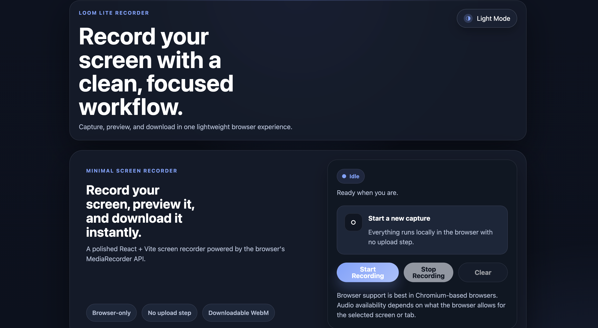
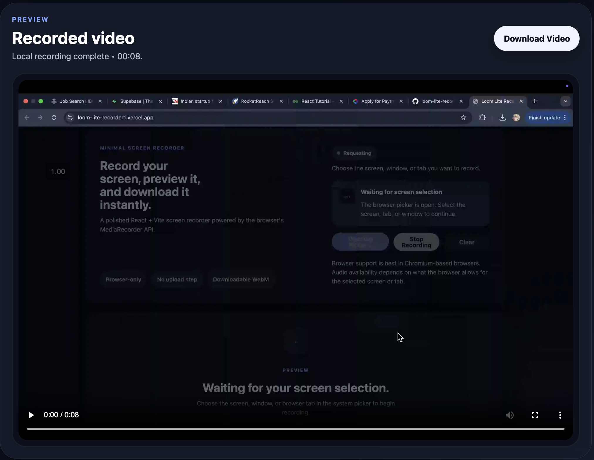

<div align="center">

# Loom Lite Recorder

### A polished Loom-style screen recorder built with React + Vite for quick browser-based capture, preview, and download.

[](https://loom-lite-recorder1.vercel.app/)
[](https://github.com/SHAHZEB28/Loom-Lite-Recorder)
[](https://react.dev/)
[](https://vitejs.dev/)

[Live Demo](https://loom-lite-recorder1.vercel.app/) • [GitHub Repository](https://github.com/SHAHZEB28/Loom-Lite-Recorder)

</div>

## Demo

Explore the app here: [loom-lite-recorder1.vercel.app](https://loom-lite-recorder1.vercel.app/)

## Features ✨

- Screen recording powered by the browser `MediaRecorder` API
- Start and stop capture with a simple, focused workflow
- Instant in-app video preview after recording ends
- One-click download as a `.webm` file
- Light and dark mode with theme persistence
- Clean UI designed for clarity and low friction
- Edge case handling for cancel, permission denial, double start, and cleanup

## Tech Stack

- React
- Vite
- JavaScript (ES Modules)
- MediaRecorder API
- `navigator.mediaDevices.getDisplayMedia`
- CSS for custom UI styling

## Screenshots 🖼️

> Add product screenshots here to showcase the recording flow, preview state, and dark mode UI.

```md



```

## Run Locally 🚀

1. Clone the repository

```bash
git clone https://github.com/SHAHZEB28/Loom-Lite-Recorder.git
```

2. Move into the project folder

```bash
cd Loom-Lite-Recorder
```

3. Install dependencies

```bash
npm install
```

4. Start the development server

```bash
npm run dev
```

5. Open the local URL shown in your terminal

## Usage

1. Click `Start Recording`
2. Choose the screen, window, or tab you want to capture
3. Click `Stop Recording` when finished
4. Preview the result directly in the app
5. Download the recording as a `.webm` file

## Key Highlights

- Browser-only workflow with no backend dependency
- Clean product thinking with clear states and feedback
- Handles real user scenarios instead of only the happy path
- Built as a practical MVP with recruiter-friendly polish

## Limitations

- This is an MVP, not a full Loom replacement
- Export is limited to `.webm`
- Browser support is strongest in Chromium-based browsers
- Audio capture depends on browser and screen-sharing permissions

## Future Improvements 🔮

- MP4 conversion/export support
- Recording history and session management
- Webcam overlay and microphone controls
- Shareable links via cloud upload
- Trimming and lightweight editing tools

## Author 👨‍💻

**Shahzeb Hussain**

- GitHub: [SHAHZEB28](https://github.com/SHAHZEB28)
- Project: [Loom Lite Recorder](https://github.com/SHAHZEB28/Loom-Lite-Recorder)
